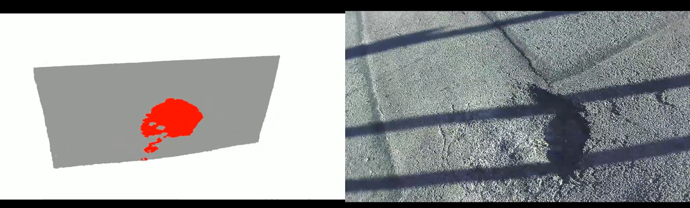

# Point Cloud Pothole and Bump Detection

A computer vision project for detecting road surface anomalies (potholes and bumps) from ZED camera point cloud data using plane fitting and statistical analysis.

📋 Project Overview
This system processes 3D point cloud data from ZED camera recordings to:

Fit a reference plane to the road surface

Detect deviations from the plane as potholes (depressions) and bumps (elevations)

Visualize results with color-coded point clouds

Generate processed frames and video outputs

🏗️ Project Structure
text
 plane_fitting_final.py    # Main processing pipeline
 viz.py                    # Visualization and point cloud inspection
 generate_screens.py       # Generate screenshots from PLY files
 generate_video.py         # Create video from processed frames
 processed_frames/         # Output directory for processed PLY files
 screenshots/              # Output directory for rendered images
 output.mp4               # Final video output
 
🔧 Core Components
1. Main Processing Pipeline (plane_fitting_final.py)
Key Functions:

knn_search(): KD-tree based nearest neighbor search for point cloud smoothing
smooth_point_cloud_numpy(): Applies iterative smoothing using KNN averaging
process_point_cloud(): Main processing function that:
Filters invalid points and downsamples
Removes outliers using radius-based filtering
Smooths the point cloud
Performs RANSAC plane fitting
Detects potholes and bumps using statistical thresholds
Colors points (red=potholes, blue=bumps, gray=background)

Detection Logic:

Uses percentile-based thresholds (default: 7th and 93rd percentiles)
Applies stricter thresholds (4th and 96th percentiles) for confirmation
Requires detected points to be statistically significant (2.2σ for potholes, 2.5σ for bumps)
Performs additional outlier removal on detected regions

2. Visualization (viz.py)

Loads and displays processed PLY files
Optional red-point cleaning functionality (commented out)
Interactive 3D visualization using Open3D

3. Video Generation Pipeline
   
generate_screens.py: Creates 2D screenshots from 3D point clouds with configurable rotation
generate_video.py: Combines screenshots into MP4 video with adjustable FPS

🚀 Usage
1. Process Point Cloud Data
bash
python plane_fitting_final.py
Configuration in main():

svo_path: Path to ZED camera recording file
start_frame, end_frame: Frame range to process
output_folder: Directory for processed PLY files

2. Visualize Results
bash
python viz.py
Modify the ply_file variable to specify which processed frame to view.

3. Generate Video
bash
python generate_screens.py
python generate_video.py
⚙️ Parameters & Configuration
Point Cloud Processing
Voxel size: 0.005m for downsampling

Outlier removal: 20 neighbors within 0.03m radius
Smoothing: 10 neighbors, 5 iterations
RANSAC: 3 points, 1000 iterations, 0.005m distance threshold
Detection thresholds: 7th/93rd percentiles (initial), 4th/96th percentiles (confirmation)

Camera Settings
Depth mode: ULTRA
Resolution: HD720
Units: Meters

🎨 Output
Color-coded point clouds: Red (potholes), Blue (bumps), Gray (road surface)
Status classification: "flat", "pothole", "bump", or "both"
Statistical reporting: Min/max/avg distances, thresholds, standard deviation

📊 Detection Methodology
Preprocessing: Filtering, downsampling, outlier removal, and smoothing
Plane Fitting: RANSAC algorithm to find dominant road plane
Distance Calculation: Compute perpendicular distances from each point to the plane
Statistical Analysis: Use percentile-based thresholds to identify outliers
Validation: Apply statistical significance tests and secondary outlier removal
Classification: Categorize as pothole, bump, both, or flat surface

🛠️ Dependencies
python
pyzed.sl      # ZED camera SDK
open3d        # 3D point cloud processing and visualization
numpy         # Numerical computations
scipy         # KD-tree for nearest neighbor search
tqdm          # Progress bars
opencv-python # Video generation

📝 Notes
The system includes a plane normal correction (negation) to handle upside-down plane fitting
Multiple outlier removal stages ensure clean detection results
Configurable frame ranges allow processing specific segments of long recordings
The video generation pipeline includes viewpoint rotation for better visualization
This pipeline is particularly useful for road maintenance applications, infrastructure inspection, and autonomous vehicle navigation systems.
