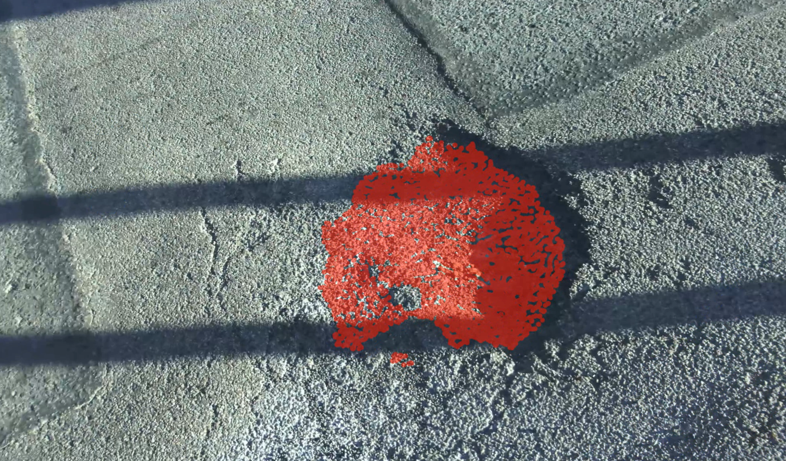

# Point Cloud–Based Pothole and Bump Detection

A computer vision pipeline for detecting **road surface anomalies**—specifically **potholes (depressions)** and **bumps (elevations)**—from **ZED stereo camera point cloud data**.

This project leverages **RANSAC plane fitting** and **statistical analysis** to classify anomalies in 3D space, with visualization support for both **3D point clouds** and **Augmented Reality (AR)–style 2D video overlays**.

> 📄 For a detailed explanation of the methodology, assumptions, and evaluation, refer to the accompanying **PDF report**.

---

## Project Overview

This system processes 3D point cloud data extracted from ZED camera recordings to:

- Estimate the dominant **road surface plane**
- Identify **deviations** from the plane using statistical thresholds (Z-score / standard deviation)
- Apply **KNN smoothing** and **outlier removal** to reduce sensor noise
- Produce **color-coded 3D point clouds**
- **Reproject detected 3D anomalies onto the original 2D video** for AR-style visualization

---

## Example Output

### 1. 3D Point Cloud Analysis


*3D view of the road surface showing plane inliers (gray), potholes (red), and bumps (blue).*

---

### 2. 2D Video Overlay


*Reprojection of detected anomalies onto the original video frame.*

#### Color Legend
- **Red** → Potholes (depressions / negative deviations)
- **Blue** → Bumps (elevations / positive deviations)
- **Gray** → Road surface (plane inliers)

---

## Project Structure

```text
.
├── plane_fitting_final.py     # Main 3D processing pipeline
├── potholes_overlayed.py      # Generates 2D AR-style overlay video
├── viz.py                     # Interactive 3D point cloud visualization
├── generate_screens.py        # Render 2D screenshots from 3D PLY files
├── generate_video.py          # Create MP4 from rendered screenshots
├── processed_frames/          # Output directory for processed .ply files
├── screenshots/               # Intermediate rendered images
├── output.mp4                 # Final 3D visualization video
├── output_overlayed.mp4       # Final 2D AR-style video
├── screen.png                 # Sample 3D output
└── overlayed.png              # Sample 2D overlay output
```

---

## Data Source

- **Dataset:** Villanova Pothole Dataset  
- **Source File:** `HD2K_SN39967967_08-46-22.svo2`  
- **Hardware:** Stereolabs **ZED Stereo Camera**

---

## Core Components

### 1. Main Processing Pipeline (`plane_fitting_final.py`)

Implements the full 3D anomaly detection workflow.  
Reads raw `.svo2` data, processes depth information, and outputs colored `.ply` point clouds.

#### Key Techniques

- **KNN Smoothing**
  - `knn_search()`
  - `smooth_point_cloud_numpy()`
- **RANSAC Plane Fitting**
  - Robust estimation of the dominant road surface
- **Statistical Thresholding**
  - **Potholes:**  
    - Below 4th percentile  
    - Distance > **2.2σ**
  - **Bumps:**  
    - Above 96th percentile  
    - Distance > **2.5σ**
- **Frame-Level Classification**
  - Flat
  - Pothole
  - Bump
  - Both

---

### 2. 2D Overlay Visualization (`potholes_overlayed.py`)

**New Feature** — bridges the 3D and 2D domains.

#### Functionality

- Reads processed `.ply` files and the original ZED video
- Reprojects 3D points onto 2D image space using a **pinhole camera model**
- Uses ZED intrinsic parameters for accurate reprojection
- Draws **dense, semi-transparent overlays** to highlight anomalies

#### Output

- Generates a **slow-motion (10 FPS)** annotated video  
- Improves qualitative inspection of detection accuracy

---

### 3. 3D Rendering Tools

- **`viz.py`**
  - Interactive Open3D visualization for frame-by-frame inspection
- **`generate_screens.py`**
  - Renders 2D images from 3D point clouds
- **`generate_video.py`**
  - Produces a rotating 3D visualization video

---

## Usage

### Step 1: Process the Data

```bash
python plane_fitting_final.py
```

### Step 2: Generate Visualizations

#### Option A: 2D AR-Style Overlay Video (Recommended)

```bash
python potholes_overlayed.py
```

#### Option B: 3D Rendered Video

```bash
python generate_screens.py
python generate_video.py
```

### Step 3: Interactive Inspection

```bash
python viz.py
```

---

## Dependencies

- Python 3.x
- `pyzed.sl` (ZED SDK)
- `open3d`
- `numpy`
- `scipy`
- `tqdm`
- `opencv-python`

---

## Applications

- Road maintenance and automated inspection
- Infrastructure monitoring
- Autonomous vehicle perception
- Smart city sensing systems


