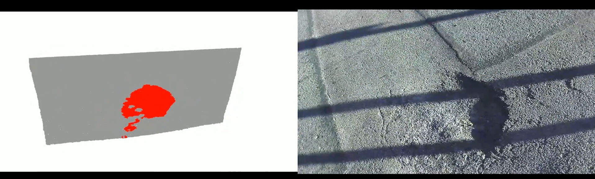

# Point Cloud–Based Pothole and Bump Detection

A computer vision pipeline for detecting **road surface anomalies**—specifically **potholes (depressions)** and **bumps (elevations)**—from **ZED stereo camera point cloud data**, using **RANSAC plane fitting** and **statistical analysis**.

> For a detailed explanation of the methodology, assumptions, and evaluation, refer to the accompanying **PDF report**.

---

## Project Overview

This system processes 3D point cloud data extracted from ZED camera recordings to:

- Estimate the dominant **road surface plane**
- Identify **deviations** from the plane as potholes or bumps
- Apply **statistical validation** to reduce false detections
- Produce **color-coded 3D point clouds**
- Generate **rendered frames** and a **final video visualization**

---

## Example Output



**Color legend:**
- **Red** → Potholes (negative deviations)
- **Blue** → Bumps (positive deviations)
- **Gray** → Road surface (inliers)

---

## Project Structure

```
.
├── plane_fitting_final.py     # Main processing pipeline
├── viz.py                     # Interactive point cloud visualization
├── generate_screens.py        # Render 2D screenshots from PLY files
├── generate_video.py          # Create MP4 video from rendered frames
├── processed_frames/          # Output directory for processed PLY files
├── screenshots/               # Rendered images for video generation
├── output.mp4                 # Final visualization video
└── screen.png                 # Sample visualization image
```

---

## Core Components

### 1. Main Processing Pipeline (`plane_fitting_final.py`)

This script implements the complete detection workflow.

#### Key Functions

- **`knn_search()`**  
  KD-tree–based nearest neighbor search for spatial smoothing.

- **`smooth_point_cloud_numpy()`**  
  Iterative KNN averaging to reduce sensor noise.

- **`process_point_cloud()`**  
  End-to-end processing routine:
  - Invalid point filtering and voxel downsampling  
  - Radius-based outlier removal  
  - Iterative point cloud smoothing  
  - RANSAC-based plane fitting  
  - Distance computation from plane  
  - Statistical anomaly detection  
  - Color assignment and classification  

#### Detection Logic

- Initial thresholds:
  - **7th percentile** → pothole candidates
  - **93rd percentile** → bump candidates
- Confirmation thresholds:
  - **4th percentile** → potholes
  - **96th percentile** → bumps
- Statistical validation:
  - Potholes: **≥ 2.2σ**
  - Bumps: **≥ 2.5σ**
- Additional localized outlier removal applied to detected regions

Each frame is classified as:
- `flat`
- `pothole`
- `bump`
- `both`

---

### 2. Visualization (`viz.py`)

- Loads processed `.ply` point clouds
- Interactive 3D inspection using **Open3D**
- Optional post-processing for detected regions (commented for experimentation)

---

### 3. Video Generation Pipeline

#### `generate_screens.py`
- Renders 2D screenshots from 3D point clouds
- Supports configurable camera rotation

#### `generate_video.py`
- Converts rendered images into an MP4 video
- Adjustable frames-per-second (FPS)

---

## Usage

### 1. Process Point Cloud Data

```bash
python plane_fitting_final.py
```

---

### 2. Visualize a Processed Frame

```bash
python viz.py
```

---

### 3. Generate Video Output

```bash
python generate_screens.py
python generate_video.py
```

---

## Dependencies

- Python 3.x
- `pyzed.sl`
- `open3d`
- `numpy`
- `scipy`
- `tqdm`
- `opencv-python`

---

## Applications

- Road maintenance and inspection  
- Infrastructure monitoring  
- Autonomous vehicle perception  
- Smart city sensing systems  

